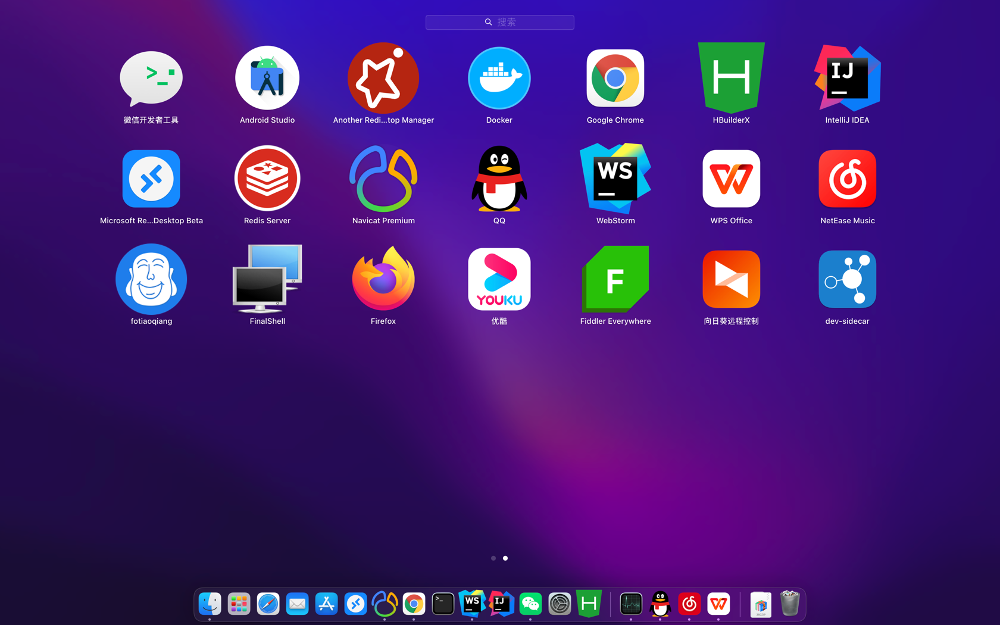

## 求职简历
::: tip 
手机: [17603844084]() 
暂住址：河南许昌建安区 
薪资：面议 可接受(上海｜杭州｜郑州｜许昌) 
工作室：[许昌市建安区哥一奥网络科技工作室](./company.md) 
下面是简介真实可背调
:::
## 3年学习加6年开发经验，学习能力极高，参与或整体负责做过多个大小型项目
### 负责整体架构,开发,测试,调试,上线,维护项目目录如下(小项目就不写了)：
>[马鞍山看守所,拘留所,淄博看守所,淄川看守所,吉林省白城市看守所`刷脸`点餐`小程序` `Android` `可点击查看详情`](../project/prison.md)

>[河南贷款资助中心系统 `学生小程序在线预约办理贷款` `大屏叫号` `刷身份证取号` ](../project/zizhu.md)

>[郑州颐和医院 `商户收银` `员工卡` `员工刷脸支付` `小程序付款码` `小程序` `商户端`](../project/canteen.md)

>[郑州`分销` `商城` `会员积分` `三级分销`](../project/shop.md)

>[ChatGPT插件`上架uniapp插件市场` `对接官方接口` ](../project/chatgpt.md)

>[云南省政府问卷投票项目`可点击查看详情`](../project/vote.md)
> > 疫情期间问卷调查以及采集填写小程序 后台生成小程序问卷二维码，以及汇总导出Word Excel
 
>[云南省跆拳道委员会网站`可点击查看详情`](../project/taekwondo.md)

>[植友 `商城` `点服运维`  `小程序` `公众号` `Android` `IOS` `可点击查看详情`](../project/zhiyou.md)

>[每日一回收 `小程序` `可点击查看详情`](../project/recovery.md)

>[森尼瑞 `能耗管理系统` 以及接报修`小程序` `可点击查看详情`](../project/ecs.md)

>[许继集团对外认证 招标 竞价网站`可点击查看详情`](../project/xuji.md)

>[百联集团 陆家嘴集团 国金中心 `能耗管理系统` 以及`计费系统` `可点击查看详情`](../project/canneng.md)

## 前端技术栈
::: tip
###  JavaScript `vue全家桶` `uniapp` `vue3` `react` `vuepress` `nuxt` `websocket` `echarts`  
###  UI `element` `antd`
###  其他 `Andriod` `uniapp原生插件` `微信小程序` `公众号`
:::
## 后端技术栈
::: tip
### Java `spring全家桶` `websocket` `mysql` `mybits` `mybits-plus` `redis` `excel` `maven`
### 运维 `docker` `Nginx` `oss`
:::
## 日常开发工具
::: tip
### `idea` `webstorm` `hbudider` `android` `fiddler`

### 系统熟练度`Mac`>`Windows`>`Linux`
:::

## 生涯进度
::: tip
| 年度     | 情况 | 薪资 | 背景 |
|:---------|:-----|:-----|:-----|
| 2017中   | 中软国际(承诺7k结果发offer给到6k) | 6k | 小白只会javaWeb |
| 2017底   | 上海璨能能源科技有限公司(有个后端大佬带) | 8k | 慢慢接触手机端ui微信公众号，同时后端一直在写 |
| 2018   | 上海璨能能源科技有限公司 | 12k | 学习前后分离scss，vue，uniapp，同时后端一直在写 |
| 2019底   | 许昌调色板科技(外包在家办公) | 6k | vue，uniapp，原型图ui实现，同时后端一直在写 |
| 2020   | 许昌许继集团(驻场开发) | 6k | 学习react，隔离装置，多数据源|
| 2021   | 许昌调色板科技(合伙外包在家办公或出差) | 6k+ | 学习原生安卓，uniapp原生插件，vuepress，同时后端一直在写 |
| 2022   | 杭州中金云创 | 14k | 纯前端工具人 |
| 2023   | 北京新祥瑞科技有限公司 | 10k | 在家办公+偶尔出差 |
:::

