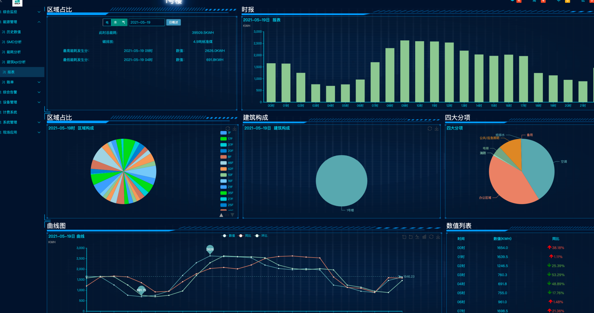
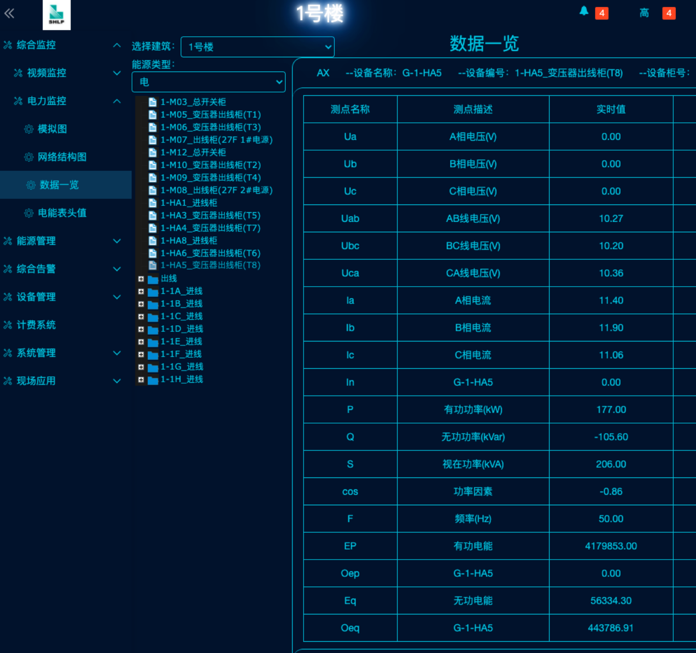
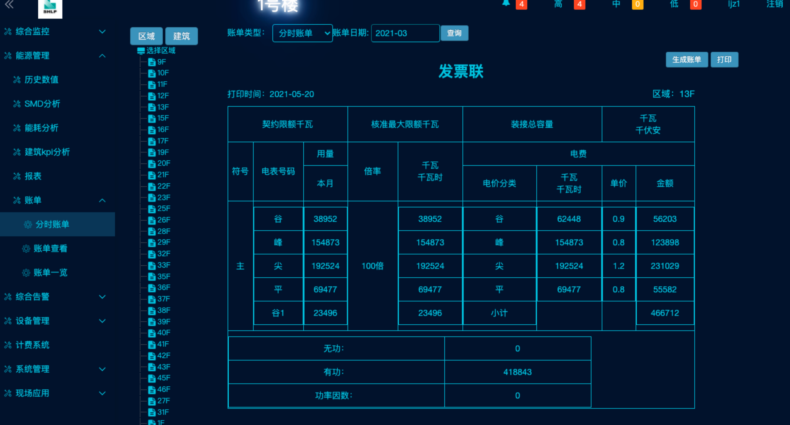
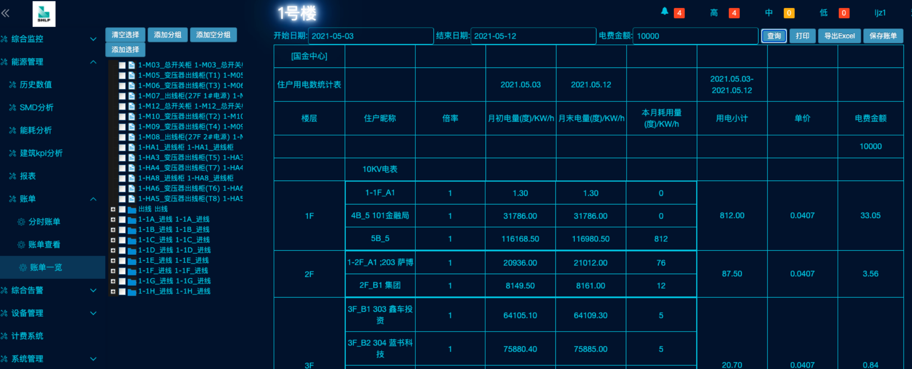

[返回简历](../other/my.md)

## 上海璨能能耗系统简介
由于这个项目是17年底开始做的所以用的技术比较老
上传政府分项计量 电表采集 能耗告警 断开告警 手机app推送
接入了 上海百联集团 各建筑 以及陆家嘴6栋楼 国金物业 计费+能耗系统
统计能耗数据 视频监控 
## 大屏可视化展示

## 本地部署采集器定时采集点能耗数据并存本地数据库并用`websocket`链接云socket可直接登陆云平台链接websocket访问本地实时数据

## 利用区间值算出能耗价格账单 可分时尖峰评估计算

## 以及按照区间段展示账单

