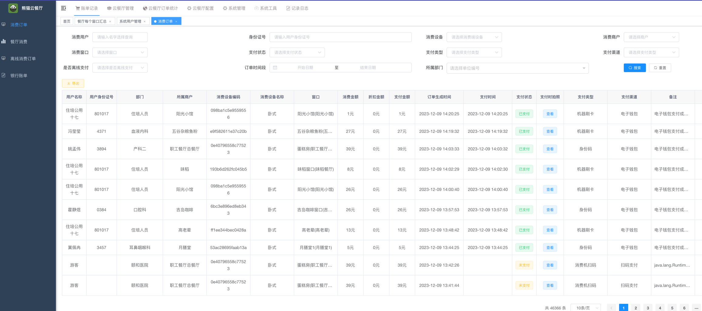

[返回简历](../other/my.md)
## 项目介绍
全权负责开发：郑州颐和医院商户收银系统
功能 ：
- 员工录入系统 采集人脸
- 设备刷脸+扫支付码+身份码+刷卡+离线模式+视频广告
- 员工端小程序可点餐 设置人脸 余额查询 出示身份码
- 商户段小程序可以查看每日营业额，以及外卖菜单维护
- 后台每日汇总出账单 以及各种明细
## 使用到的技术 
- 利用`docker`部署项目 脚本定期备份数据库
- 使用虹软人脸识别sdk 刷卡sdk 扫码sdk
## 项目展示

## 设备演示视频
<video style="width: 100%" controls src="./file/canting.mp4"/>

