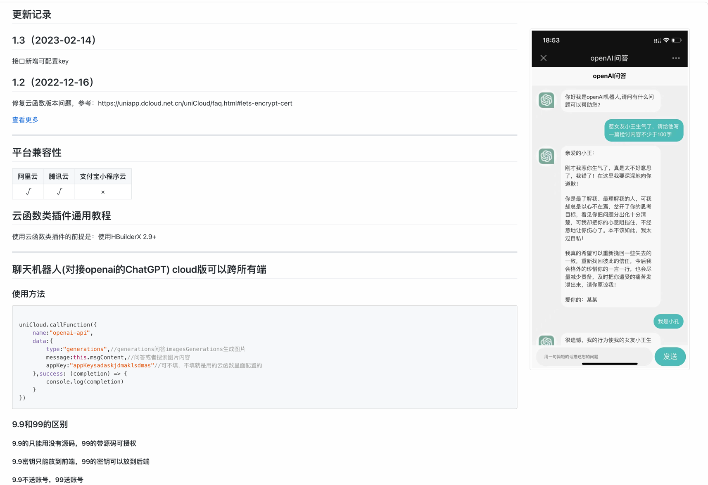
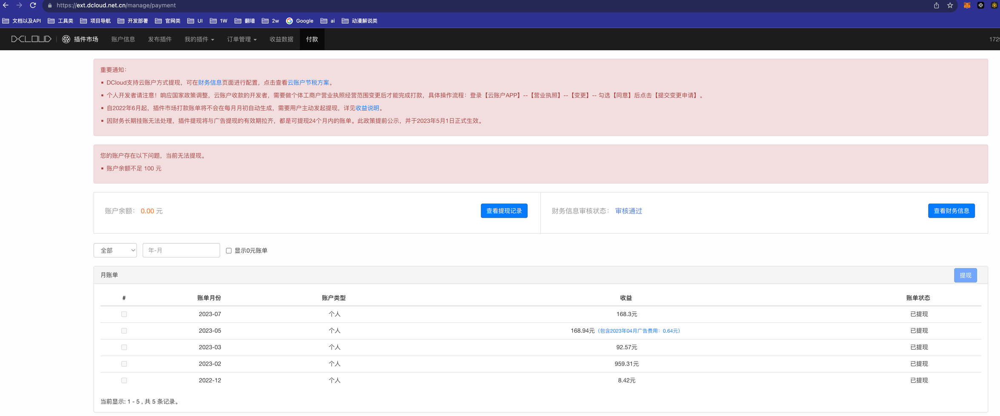

[返回简历](../other/my.md)
## 项目介绍
全权负责开发：ChatGPT插件
功能 ：
- 上下文对话
- 对接官方api
- 同时用原生IOS做了一个chatgpt
- 
## 视频
<video style="width: 100%" controls src="./file/ioschat.mp4"/>
<video style="width: 100%" controls src="./file/chatgpt1.mp4"/>
  
## 使用到的技术 
- 利用`uniCloud`编写脚本
- 对接chatgpt官方接口

## 收益

