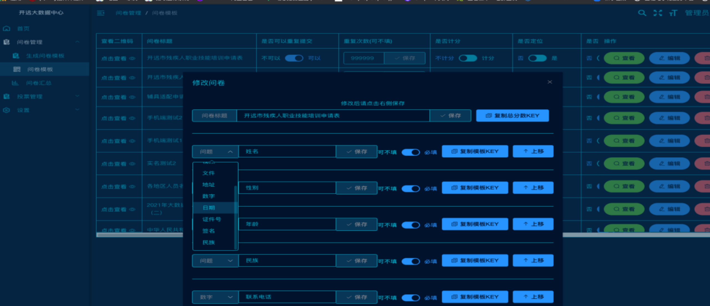
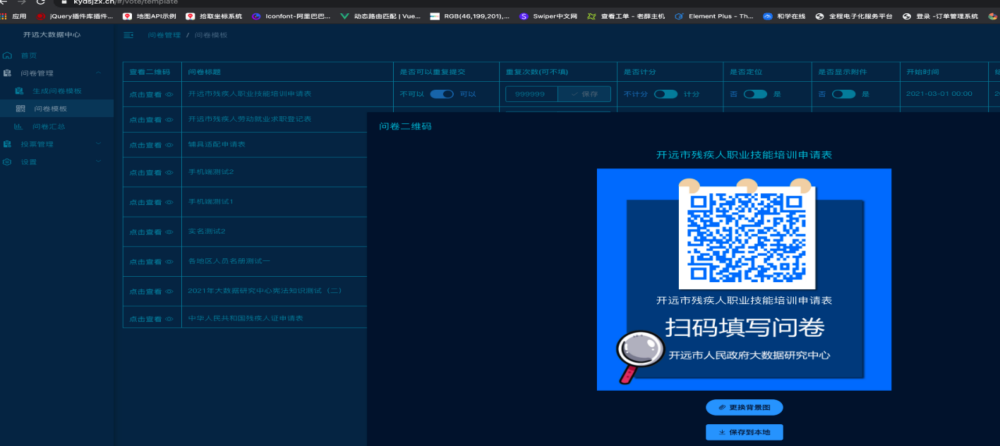
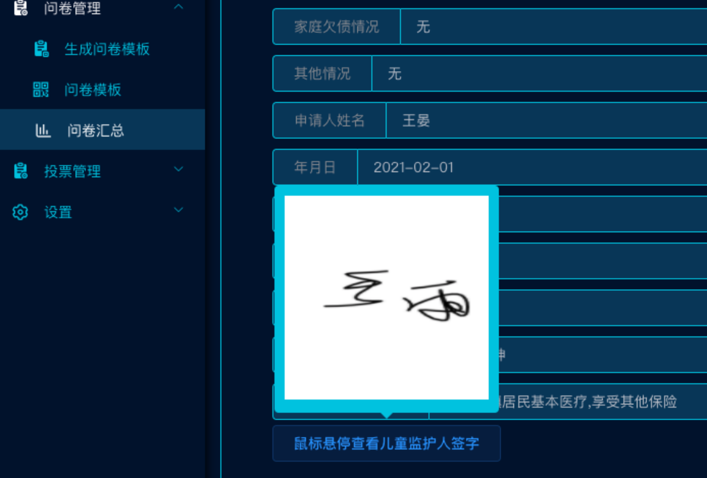

[返回简历](../other/my.md)

## 开远市政府问卷调查投票系统介绍
政府项目，发布问卷调查》生成小程序二维码》用户扫码填写表格，可选址定位，可签名，可上传视频图片

用户填写并签名完毕后，可出示二维码供他人扫码查看，后台可导出模版word打印，也可导出传统excel 
## 用到技术栈
`vue`全家桶做前端 `echarts`做报价统计图

`java` `springboot`+`mybits` 做后端

## 云南开远市政府疫情防控二维码填写入乡报告，以及贫困人口统计

## 导入问卷模版，批量导出可打印word可自动签名 适应手机端

## 可在手机端签名定位。

