## 开远市政府问卷调查投票系统介绍
政府项目，发布问卷调查》生成小程序二维码》用户扫码填写表格，可选址定位，可签名，可上传视频图片

用户填写并签名完毕后，可出示二维码供他人扫码查看，后台可导出模版word打印，也可导出传统excel 
## 用到技术栈
`vue`全家桶做前端 `echarts`做报价统计图 
`excel` `word` 导入导出问卷 
`java` `springboot`+`mybits` 做后端

# 使用步骤
## 1.做好问卷表格
> 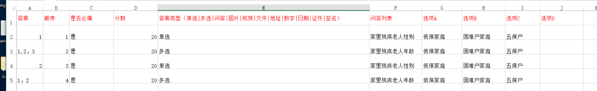
> > ### 表格格式导入说明：
> > ### 1.第一行的前6格内容（”答案	顺序	是否必填	分数	答案类型（单选|多选|问答|图片|视频|文件|地址|数字|日期|证件|签名）问答列表”）不可更改,
> > ### 2.后续新增选项只需在后面追加即可例如 选项E选项F选项G
> > ### 3.答案类型必须是“单选|多选|问答|图片|视频|文件|地址|数字|日期|证件|签名”里面任意类型
> > ### 4.答案和分数可不填（其他除选项以外必填）
> > ### 4.1答案 单选 A填1 |B填2| C填3|D填4。。。以此类推
> > ### 4.2多选答案用逗号分隔例如： 1  1,2  1,2,3  1,2,4

## 2.生成问卷模版
> 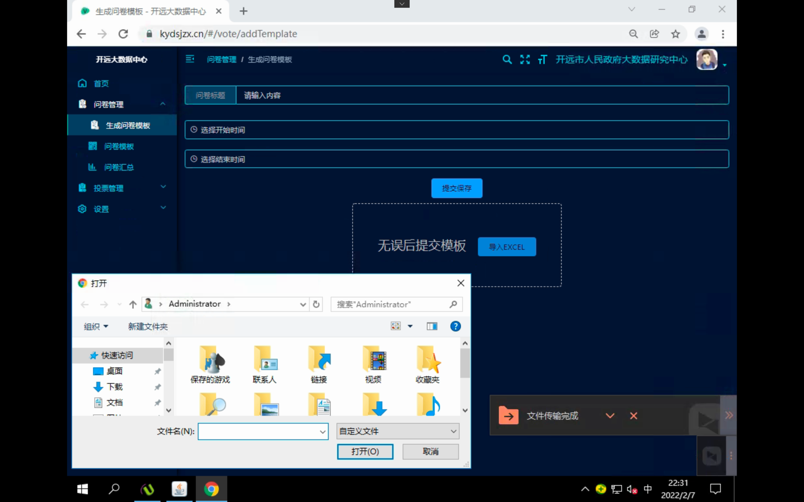
> > ### 1.填写问卷的标题
> > ### 2.选择开始结束日期
> > ### 3.上传做好的问卷表格
> > ### 4.提交保存

## 3.问卷模版
> 
> > ### 1.查看小程序二维码
> > ### 2.可重复提交问卷
> > ### 3.是否计分（选是的话会按照导入时的答案以及分数用户提交时自动算分）
> > ### 4.点击查看即可查看问卷详情统计 
>> ### 5. 点击编辑可编辑问卷内容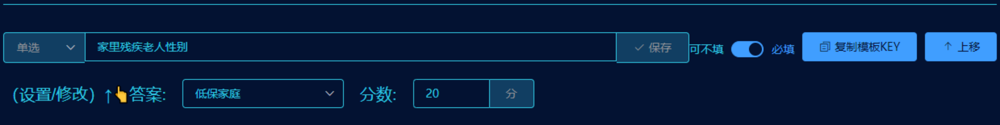
> > ### 6.问卷汇总
> > ### 7.可导出word EXCEL

## 4.导出word excel
> 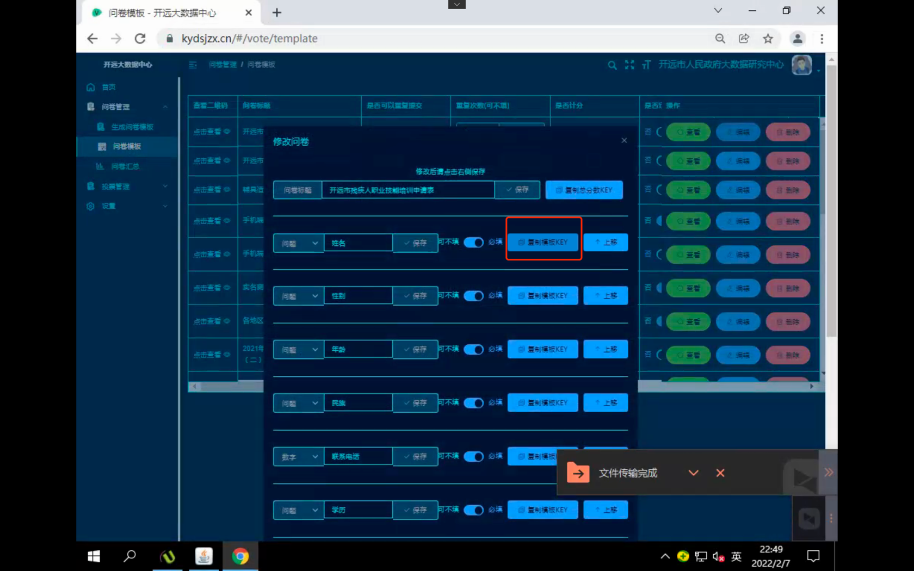
> 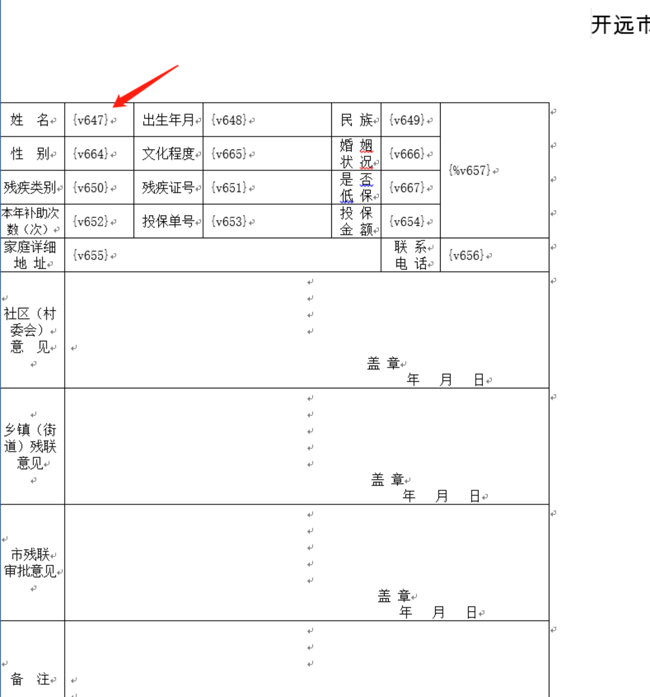
> > ### 1.第一步 制作word模板在需要填写内容的地方粘贴问卷编辑里的KEY值
> > > #### 1.1 签名之类的带图片的格式一般是 `{%v1}`
> > > #### 1.2 普通文字key格式一般是 `{v1}`
> > ### 2.第二步 导入制作成功的模板
> > ### 3.第三步 点击批量导出word，或者导出excel 即可

## 5.投票
> 
>> 新增投票活动 活动图可以不填
>> 可修改投票信息
>> 可查看小程序二维码
> 
> 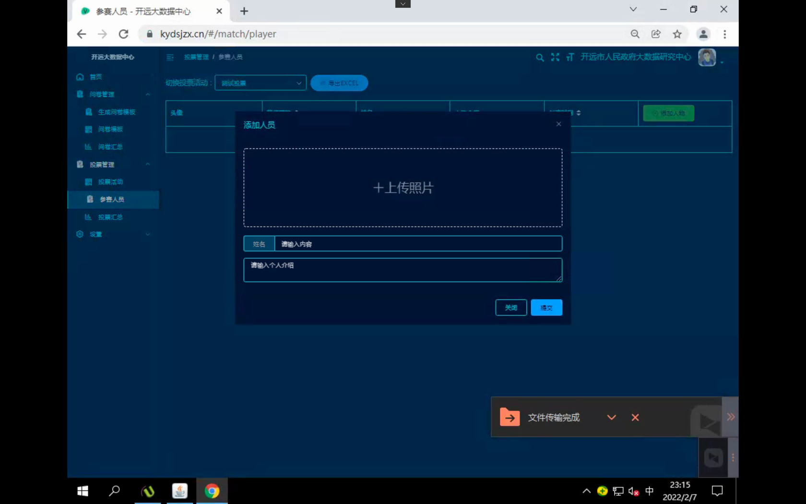
> 
>> 新增活动人员
> 
> 可导出投票EXCEL
> 可查看投票汇总图表每各参赛人票数占比和票数排名

## 6.管理员权限
> 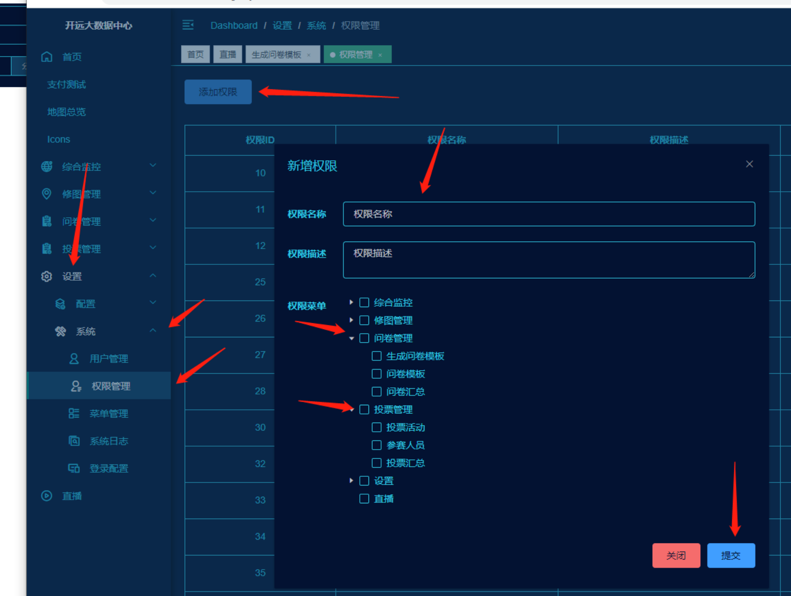
> > 新增管理员权限
> 
> 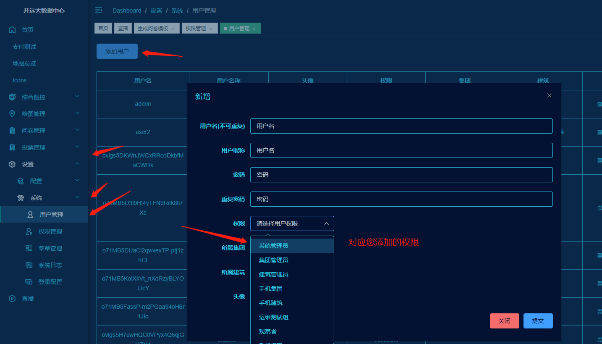
> > 新增管理员
> `用户名就是 登陆账号 所属集团所属建筑 随便选`

# 下面是介绍
## 云南开远市政府疫情防控二维码填写入乡报告，以及贫困人口统计

## 导入导出表格
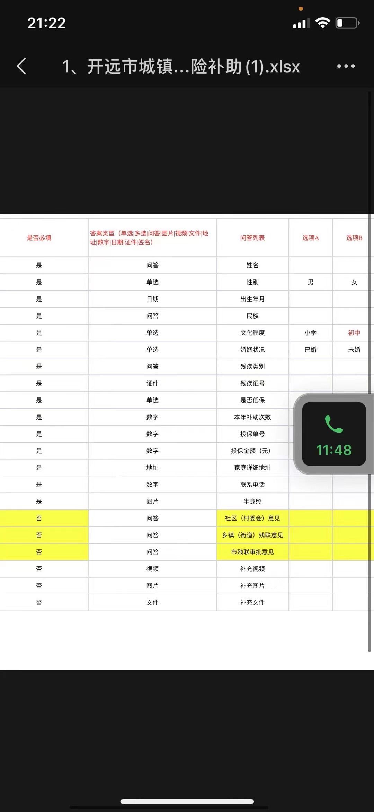
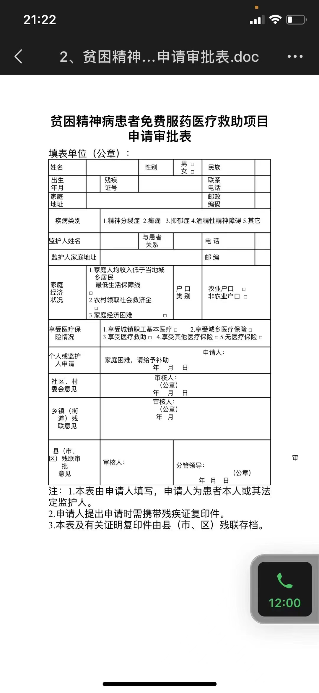
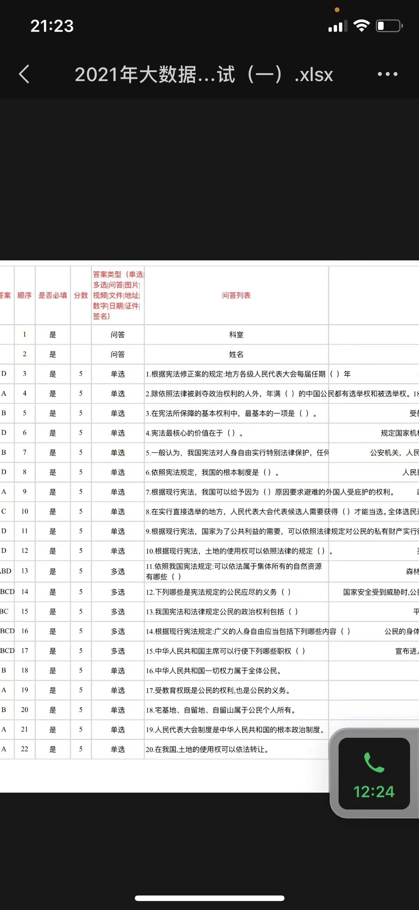

## 导入问卷模版，批量导出可打印word可自动签名 适应手机端

## 可在手机端签名定位。
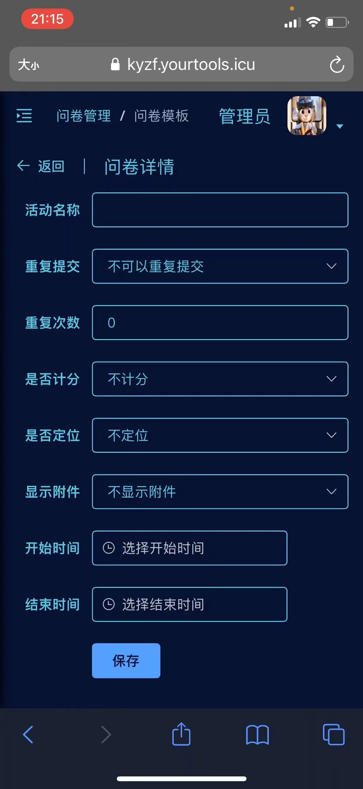
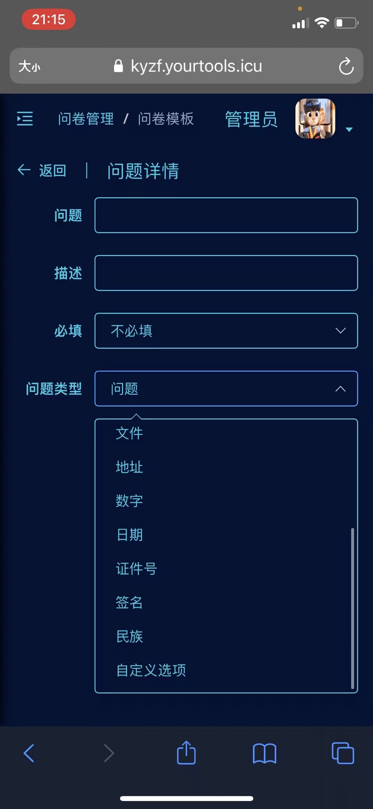

## 视频展示
<video style="width: 100%" controls src="https://vkceyugu.cdn.bspapp.com/VKCEYUGU-ce2a3b14-ff17-44c7-a7e1-c5704a867607/1e70fe69-ed7a-4705-b57e-a724b0d34a68.mp4"/>

