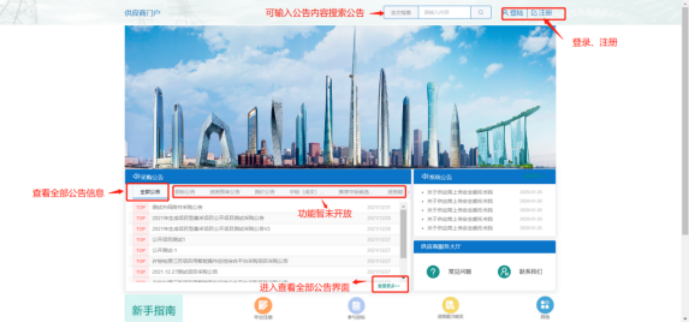
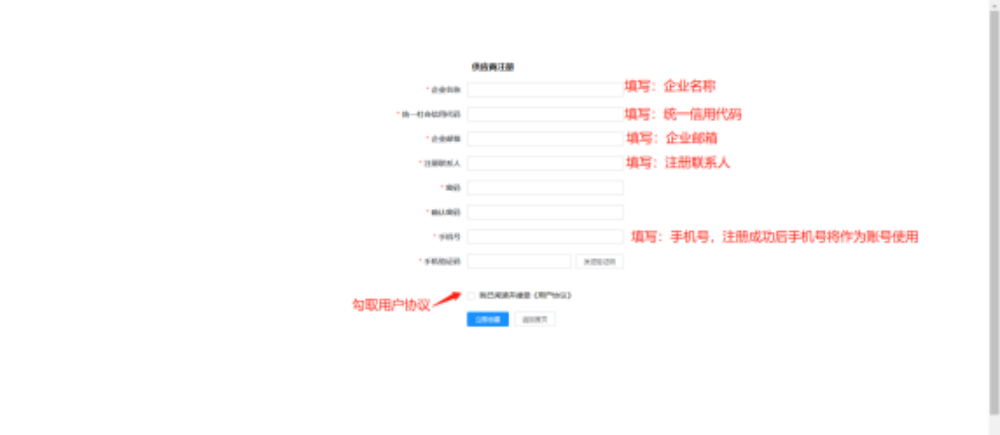
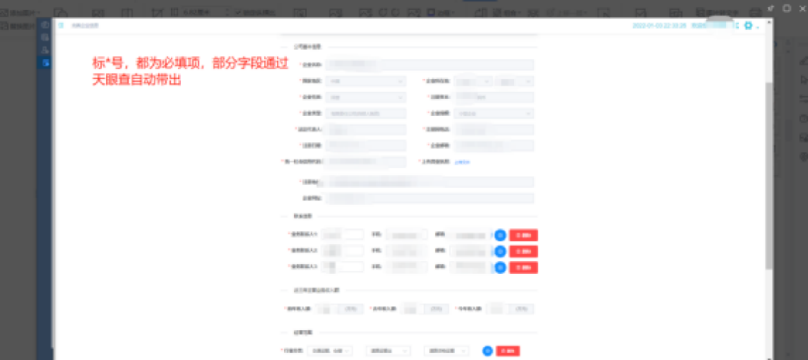
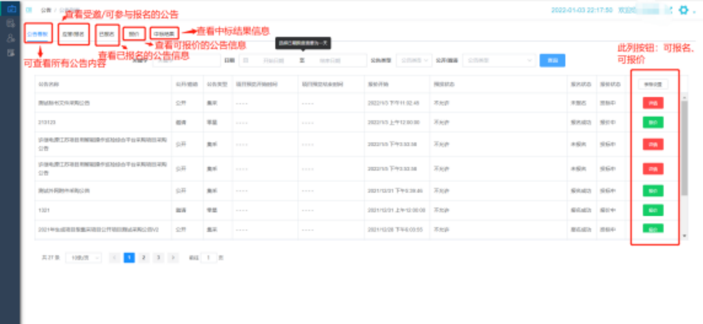
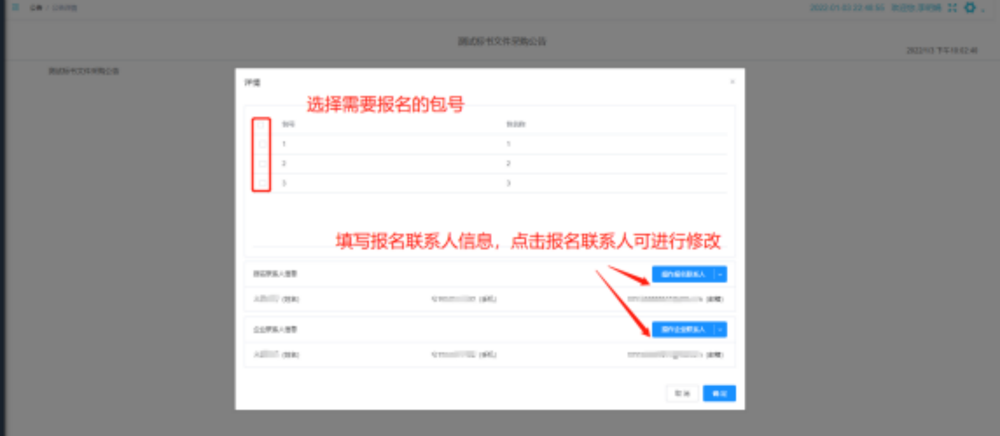
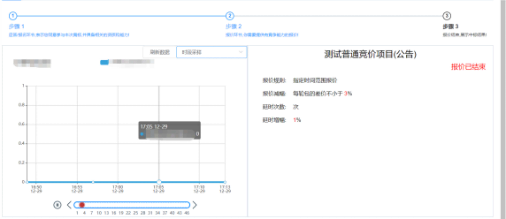
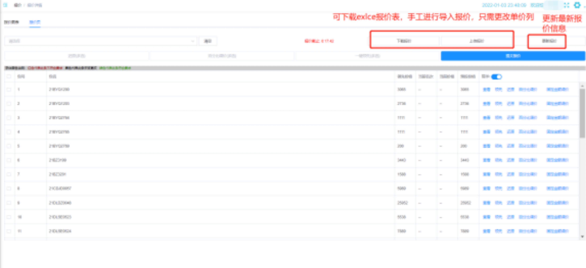
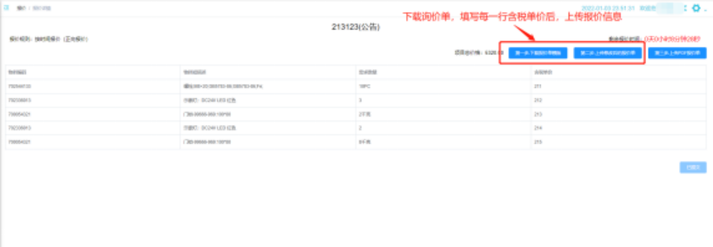

[返回简历](../other/my.md)
## 许继集团物力集约化管控系统
政府项目发布招标公告，公开招标，供应商报名报价，以及中标未中标
## 用到技术栈
`vue`做外网项目 `react`内网项目`tinymce`编辑公告`echarts`做报价统计图
`websocket` 实时报价，时间以及有新人报价会更新时间
内外网用`隔离装置`隔离 政府内网项目不做展示
## [外网手册下载](https://vkceyugu.cdn.bspapp.com/VKCEYUGU-4212d060-22ea-4808-b477-f5c9c9f2d4e2/bae77aca-5fb4-429c-959e-99be85203b77.docx)

## 1.供应商外网门户

## 2.注册界面：

## 3.完善企业信息（供应商注册成功后，需要完善企业信息，审核通过后，才能正常使用正常的报名，报价功能）

## 4.公告主界面：

## 5.公告报名界面：

## 6.询价公告报价界面：

