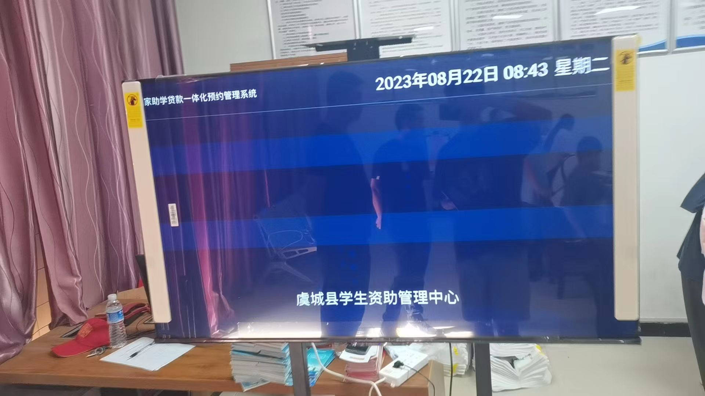

[返回简历](../other/my.md)
## 项目介绍
全权负责开发：河南贷款资助中心系统 刷身份证 预约 叫号 大屏叫号

功能 ：
- 学生静如河南省资助中心小程序进行预约
- 后台设置预约时间短以及限制配置
- 现场取票机刷身份证取票
- 后台叫号 同时大屏幕显示叫号信息 广播三次
- 后台每日汇总出账单 以及各种明细
## 使用到的技术 
- 利用`docker`部署项目 脚本定期备份数据库
- 使用身份证识别sdk
## 项目展示

## 设备演示视频
<video style="width: 100%" controls src="./file/jiaohao.mp4"/>

