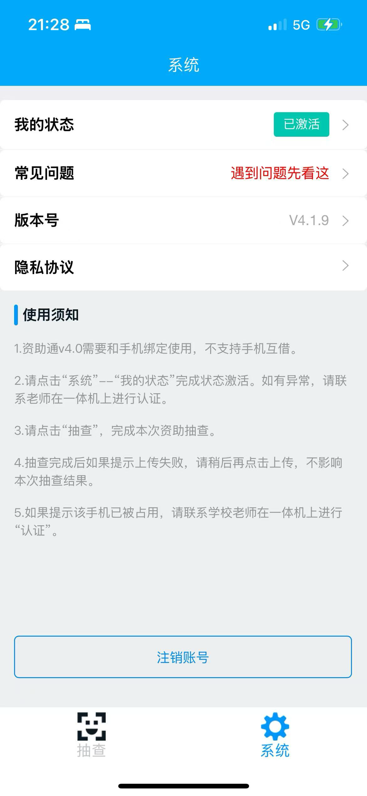
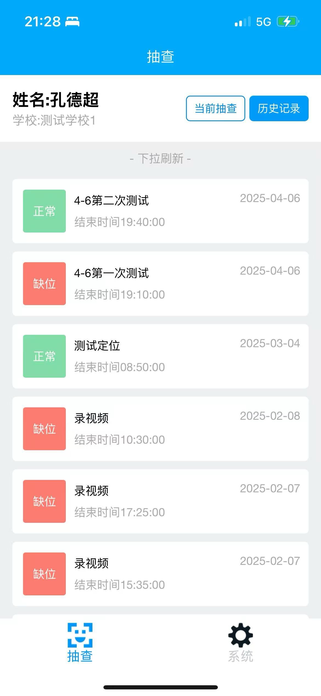
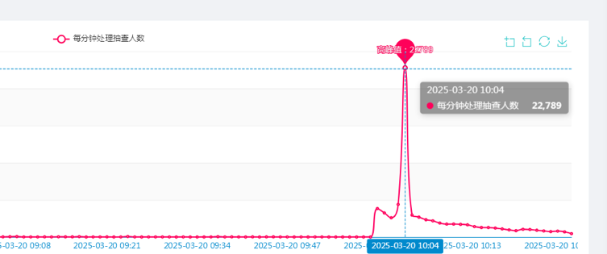
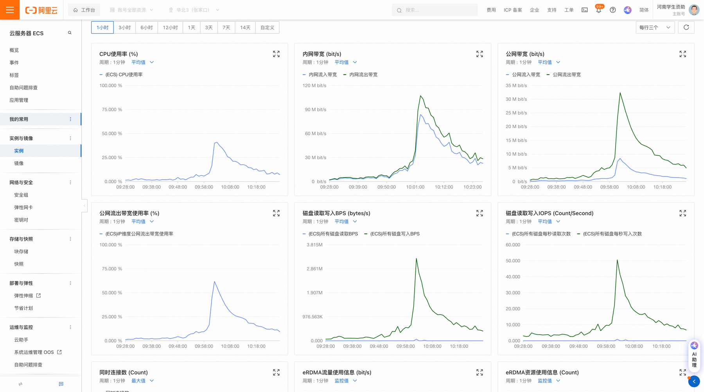

[返回简历](../other/my.md)
## 项目介绍
提供给河南省资助中心用来监管学生资助发放的系统
步骤 ：
- 省属下达考勤后个个学校组织刷脸考勤或者手机考勤
- 考勤类型：正常考勤 定向考勤 实习考勤 带范围的考勤
- 设备：一体机 分体机 手机APP
- 发布考勤时异步操作短信通知（每次要下10w+的学生考勤），同时redis进行缓存
- 查看考勤记录，月，年，导出考勤记录，导出考勤统计
## 使用到的技术 
- 利用`docker`部署项目 脚本定期备份数据库
- 前端：vue后台 uniapp老师端学生打卡端 android一体机 分体机 用来考勤 百度离线人脸识别
- 后端：java 改造ruoyi4.X mysql redis rabbitmq xxjob

## 项目展示
 ### 一体机

 ### 分体机

 ### APP
[安卓APP下载地址](https://a.app.qq.com/o/simple.jsp?pkgname=zz.cn.appimb)

## 高峰期处理水平

