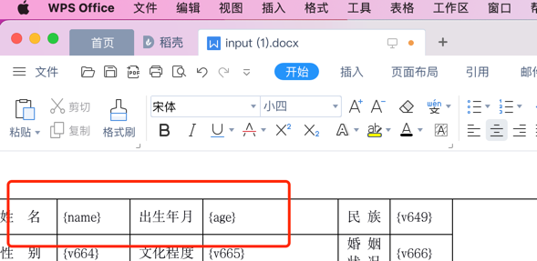

## 1. 安装依赖
```shell
npm install --save docxtemplater file-saver jszip-utils pizzip
```

## 2. 引入依赖
```js
import { saveAs } from 'file-saver'
import JSZipUtils from 'jszip-utils'
import docxtemplater from 'docxtemplater'
import PizZip from 'pizzip'
```

## 3. 创建模版


## 3. 根据模版生成word文档
```js
JSZipUtils.getBinaryContent("/static/doc/XXXXX.docx", function (error, content) {
    if (error) {
        throw error;
    }
    //let opts = {}
    //opts.centered = true;
    //opts.fileType = "docx";
    // opts.getImage = function (url) { //可设置图片，得转码
    //     return _this.base64DataURLToArrayBuffer(url);
    // }
    // opts.getSize = function () { //可设置图片大小
    //     return [100, 150]
    // }
    // let imageModule = new ImageModule(opts); //设置图片模块
    let zip = new PizZip(content); //解压缩
    let doc = new docxtemplater(); //创建docxtemplater实例
    //doc.attachModule(imageModule); //添加图片模块
    doc.loadZip(zip);//加载zip
    let data={name:'张三',age:18}//设置数据
    doc.setData(data)
    try {
        doc.render();
    } catch (error) {
        throw error;
    }
    let out = doc.getZip().generate({
        type: "blob",
        mimeType: "application/vnd.openxmlformats-officedocument.wordprocessingml.document"
    });
    saveAs(out, "name.docx");//保存
});
```
