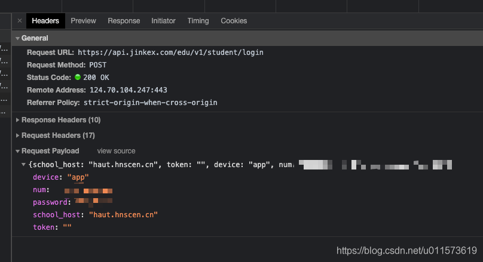
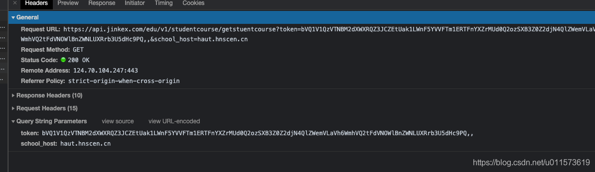
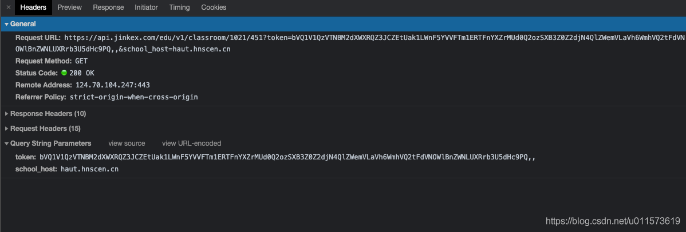
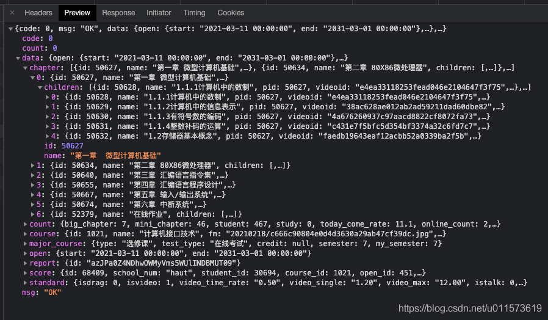
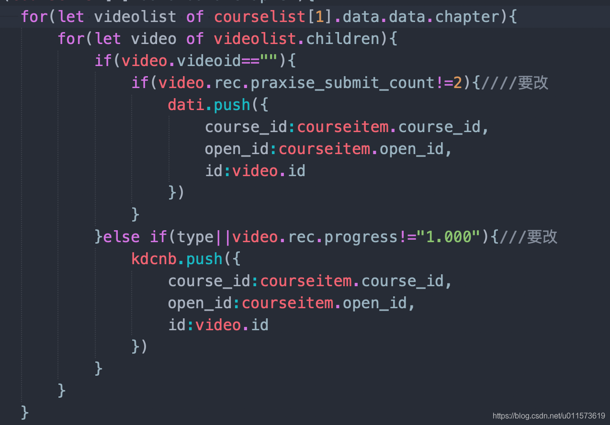
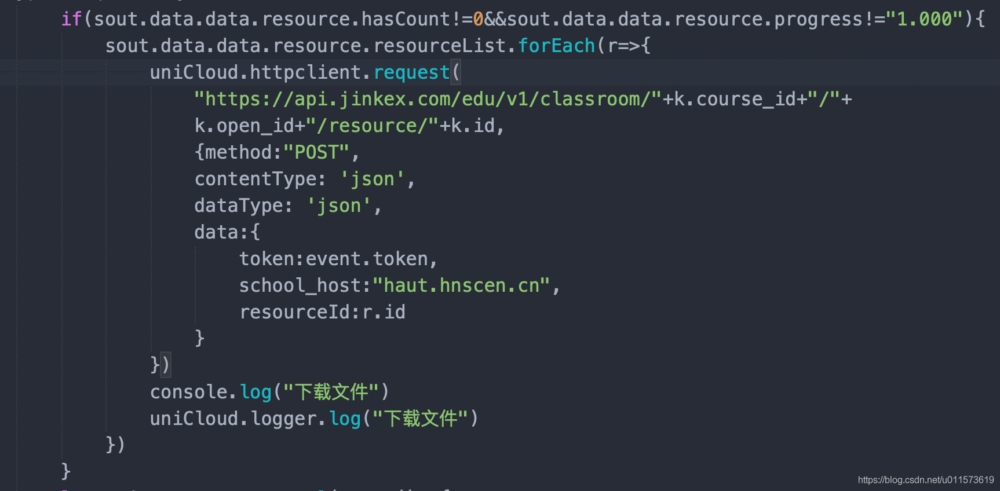

# 1.视频教程

## 1.首先登陆接口 获取用户信息
::: tip

:::
## 2.登陆返回值 （关键参数已经删除） 首先拿到 token 就等于拿到了一切用户权限
```angular2html
{
	"code": 0,
	"msg": "欢迎 XXX 登录",
	"data": {
		"id": 30694,
		"school_num": "haut",
		"num": "XXXX",
		"realname": "XXX",
		"avatar": "",
		"card": "",
		"phone": null,
		"email": null,
		"regtime": "2021-02-24 13:58:02",
		"last_time": "2021-05-26 13:43:07",
		"logcount": 8,
		"academy_id": 625,
		"academy_name": "远程与继续教育学院",
		"major_id": 596,
		"major_name": "计算机科学与技术（高起本）",
		"classes_id": 54,
		"classes_name": "1班",
		"level_id": 78,
		"level_name": "高起本",
		"batch_id": 49,
		"center_id": 164,
		"isfinish": 0,
		"credit": "0.0",
		"course_credit": "0.0",
		"exchange_credit": "0.0",
		"userType": "student",
		"token": ",,"
	},
	"count": 0
}
```
## 3.然后获取课程列表
::: tip

:::
::: tip
### 返回值如下
```angular2html
{
	"code": 0,
	"msg": "OK",
	"data": [{
		"semester": 1,
		"time": {
			"batch_id": 49,
			"start": "2018-03-01 00:00:00",
			"end": "2018-06-30 00:00:00",
			"semester": 1
		},
		"course": [{
			"course_id": 747,
			"course_name": "互联网与智慧办公",
			"course_fm": "20210203\/e6a7fff748218ddfa71166586ab21e50.png",
			"semester": 1,
			"gredit": "0.0",
			"type": "必修课",
			"test_type": "在线考试",
			"rec_status": "no in this semester",
			"rec_status_code": 0,
			"open_id": 452,
			"open_start": "2021-03-11 00:00:00",
			"open_end": "2031-03-01 00:00:00",
			"chapter_complete": 0,
			"isfree": 0,
			"chapter_count": 22,
			"video_count": 19,
			"ispass": 0
		}, {
			"course_id": 790,
			"course_name": "高等数学（一）",
			"course_fm": "jinke\/20201216\/cfee7fec5e383242956cf1627b52e84b.jpg",
			"semester": 1,
			"gredit": "0.0",
			"type": "必修课",
			"test_type": "在线考试",
			"rec_status": "no in this semester",
			"rec_status_code": 0,
			"open_id": 452,
			"open_start": "2021-03-11 00:00:00",
			"open_end": "2031-03-01 00:00:00",
			"chapter_complete": 0,
			"isfree": 0,
			"chapter_count": 43,
			"video_count": 40,
			"ispass": 0
		}, {
			"course_id": 789,
			"course_name": "大学英语（一）",
			"course_fm": "jinke\/20201026\/53076be388101aec8a6f10b5ef3461da.jpg",
			"semester": 1,
			"gredit": "0.0",
			"type": "必修课",
			"test_type": "在线考试",
			"rec_status": "no in this semester",
			"rec_status_code": 0,
			"open_id": 452,
			"open_start": "2021-03-11 00:00:00",
			"open_end": "2031-03-01 00:00:00",
			"chapter_complete": 0,
			"isfree": 0,
			"chapter_count": 36,
			"video_count": 33,
			"ispass": 0
		}, {
			"course_id": 753,
			"course_name": "思想道德与法律基础",
			"course_fm": "jinke\/20200818\/2139bb9bfd27a548f237c02ec5b25f7c.jpg",
			"semester": 1,
			"gredit": "0.0",
			"type": "必修课",
			"test_type": "在线考试",
			"rec_status": "no in this semester",
			"rec_status_code": 0,
			"open_id": 452,
			"open_start": "2021-03-11 00:00:00",
			"open_end": "2031-03-01 00:00:00",
			"chapter_complete": 0,
			"isfree": 0,
			"chapter_count": 38,
			"video_count": 35,
			"ispass": 0
		}, {
			"course_id": 745,
			"course_name": "应用写作",
			"course_fm": "jinke\/20200831\/744967f5e386a03788984c06ad91b881.png",
			"semester": 1,
			"gredit": "0.0",
			"type": "必修课",
			"test_type": "在线考试",
			"rec_status": "no in this semester",
			"rec_status_code": 0,
			"open_id": 452,
			"open_start": "2021-03-11 00:00:00",
			"open_end": "2031-03-01 00:00:00",
			"chapter_complete": 0,
			"isfree": 0,
			"chapter_count": 52,
			"video_count": 49,
			"ispass": 0
		}, {
			"course_id": 749,
			"course_name": "网络学习导引",
			"course_fm": "20210203\/a5fe1c1d218999feddf116999cf88a3b.png",
			"semester": 1,
			"gredit": "0.0",
			"type": "必修课",
			"test_type": "在线考试",
			"rec_status": "no in this semester",
			"rec_status_code": 0,
			"open_id": 452,
			"open_start": "2021-03-11 00:00:00",
			"open_end": "2031-03-01 00:00:00",
			"chapter_complete": 0,
			"isfree": 0,
			"chapter_count": 0,
			"video_count": 0,
			"ispass": 0
		}]
	}, {
		"semester": 2,
		"time": {
			"batch_id": 49,
			"start": "2018-09-01 00:00:00",
			"end": "2018-12-31 00:00:00",
			"semester": 2
		},
		"course": [{
			"course_id": 2731,
			"course_name": "成人学位英语",
			"course_fm": "20210305\/bd812de05495df04fe2aed6d3d8fa497.jpg",
			"semester": 2,
			"gredit": "0.0",
			"type": "必修课",
			"test_type": "在线考试",
			"rec_status": "no in this semester",
			"rec_status_code": 0,
			"open_id": 452,
			"open_start": "2021-03-11 00:00:00",
			"open_end": "2031-03-01 00:00:00",
			"chapter_complete": 0,
			"isfree": 0,
			"chapter_count": 17,
			"video_count": 14,
			"ispass": 0
		}, {
			"course_id": 748,
			"course_name": "大学英语（二）",
			"course_fm": "jinke\/20201202\/acd75deeabd9c799cac9d7c339e1fce6.png",
			"semester": 2,
			"gredit": "0.0",
			"type": "必修课",
			"test_type": "在线考试",
			"rec_status": "no in this semester",
			"rec_status_code": 0,
			"open_id": 452,
			"open_start": "2021-03-11 00:00:00",
			"open_end": "2031-03-01 00:00:00",
			"chapter_complete": 0,
			"isfree": 0,
			"chapter_count": 28,
			"video_count": 25,
			"ispass": 0
		}, {
			"course_id": 1050,
			"course_name": "计算机系统维护技术",
			"course_fm": "jinke\/20200827\/eb1c780e477ba27669de884fcd532d77.jpeg",
			"semester": 2,
			"gredit": "0.0",
			"type": "必修课",
			"test_type": "在线考试",
			"rec_status": "no in this semester",
			"rec_status_code": 0,
			"open_id": 452,
			"open_start": "2021-03-11 00:00:00",
			"open_end": "2031-03-01 00:00:00",
			"chapter_complete": 0,
			"isfree": 0,
			"chapter_count": 49,
			"video_count": 46,
			"ispass": 0
		}, {
			"course_id": 754,
			"course_name": "食品营养与健康",
			"course_fm": "20210205\/b96d78e42c0104b79cf5d4e7f7c3b5a4.jpg",
			"semester": 2,
			"gredit": "0.0",
			"type": "必修课",
			"test_type": "在线考试",
			"rec_status": "no in this semester",
			"rec_status_code": 0,
			"open_id": 452,
			"open_start": "2021-03-11 00:00:00",
			"open_end": "2031-03-01 00:00:00",
			"chapter_complete": 0,
			"isfree": 0,
			"chapter_count": 26,
			"video_count": 23,
			"ispass": 0
		}, {
			"course_id": 2764,
			"course_name": "面向对象程序设计",
			"course_fm": "jinke\/20210316\/9a479db85d7723c673fffe01b70db7e9.jpg",
			"semester": 2,
			"gredit": "0.0",
			"type": "必修课",
			"test_type": "在线考试",
			"rec_status": "no in this semester",
			"rec_status_code": 0,
			"open_id": 452,
			"open_start": "2021-03-11 00:00:00",
			"open_end": "2031-03-01 00:00:00",
			"chapter_complete": 0,
			"isfree": 0,
			"chapter_count": 32,
			"video_count": 29,
			"ispass": 0
		}, {
			"course_id": 2152,
			"course_name": "社交礼仪",
			"course_fm": "20210306\/0e5c8da02c057266041034b57d52e867.png",
			"semester": 2,
			"gredit": "0.0",
			"type": "必修课",
			"test_type": "在线考试",
			"rec_status": "no in this semester",
			"rec_status_code": 0,
			"open_id": 452,
			"open_start": "2021-03-11 00:00:00",
			"open_end": "2031-03-01 00:00:00",
			"chapter_complete": 0,
			"isfree": 0,
			"chapter_count": 0,
			"video_count": 0,
			"ispass": 0
		}]
	}, {
		"semester": 3,
		"time": {
			"batch_id": 49,
			"start": "2019-03-01 00:00:00",
			"end": "2019-06-30 00:00:00",
			"semester": 3
		},
		"course": [{
			"course_id": 2149,
			"course_name": "管理沟通",
			"course_fm": "20210306\/0e5c8da02c057266041034b57d52e867.png",
			"semester": 3,
			"gredit": "0.0",
			"type": "必修课",
			"test_type": "在线考试",
			"rec_status": "no in this semester",
			"rec_status_code": 0,
			"open_id": 452,
			"open_start": "2021-03-11 00:00:00",
			"open_end": "2031-03-01 00:00:00",
			"chapter_complete": 0,
			"isfree": 0,
			"chapter_count": 0,
			"video_count": 0,
			"ispass": 0
		}, {
			"course_id": 616,
			"course_name": "数据结构",
			"course_fm": "jinke\/20200827\/26571d2aac43835d2bac1553aa0a7973.png",
			"semester": 3,
			"gredit": "0.0",
			"type": "必修课",
			"test_type": "在线考试",
			"rec_status": "no in this semester",
			"rec_status_code": 0,
			"open_id": 452,
			"open_start": "2021-03-11 00:00:00",
			"open_end": "2031-03-01 00:00:00",
			"chapter_complete": 0,
			"isfree": 0,
			"chapter_count": 45,
			"video_count": 42,
			"ispass": 0
		}, {
			"course_id": 1299,
			"course_name": "电子商务案例分析",
			"course_fm": "20210303\/704a6c0628a0afe730c2c4c03b17b8ed.png",
			"semester": 3,
			"gredit": "0.0",
			"type": "必修课",
			"test_type": "在线考试",
			"rec_status": "no in this semester",
			"rec_status_code": 0,
			"open_id": 452,
			"open_start": "2021-03-11 00:00:00",
			"open_end": "2031-03-01 00:00:00",
			"chapter_complete": 0,
			"isfree": 0,
			"chapter_count": 23,
			"video_count": 20,
			"ispass": 0
		}, {
			"course_id": 644,
			"course_name": "多媒体技术与应用",
			"course_fm": "jinke\/20200827\/cc52500a37e56b11ee4eb1a736f2df79.jpg",
			"semester": 3,
			"gredit": "0.0",
			"type": "必修课",
			"test_type": "在线考试",
			"rec_status": "no in this semester",
			"rec_status_code": 0,
			"open_id": 452,
			"open_start": "2021-03-11 00:00:00",
			"open_end": "2031-03-01 00:00:00",
			"chapter_complete": 0,
			"isfree": 0,
			"chapter_count": 39,
			"video_count": 36,
			"ispass": 0
		}]
	}, {
		"semester": 4,
		"time": {
			"batch_id": 49,
			"start": "2019-09-01 00:00:00",
			"end": "2019-12-31 00:00:00",
			"semester": 4
		},
		"course": [{
			"course_id": 2209,
			"course_name": "课件制作",
			"course_fm": "20210306\/0e5c8da02c057266041034b57d52e867.png",
			"semester": 4,
			"gredit": "0.0",
			"type": "必修课",
			"test_type": "在线考试",
			"rec_status": "no in this semester",
			"rec_status_code": 0,
			"open_id": 452,
			"open_start": "2021-03-11 00:00:00",
			"open_end": "2031-03-01 00:00:00",
			"chapter_complete": 0,
			"isfree": 0,
			"chapter_count": 0,
			"video_count": 0,
			"ispass": 0
		}, {
			"course_id": 631,
			"course_name": "心理健康教育",
			"course_fm": "jinke\/20200824\/7927c352a5579a379aebf654548685b1.jpg",
			"semester": 4,
			"gredit": "0.0",
			"type": "必修课",
			"test_type": "在线考试",
			"rec_status": "no in this semester",
			"rec_status_code": 0,
			"open_id": 452,
			"open_start": "2021-03-11 00:00:00",
			"open_end": "2031-03-01 00:00:00",
			"chapter_complete": 0,
			"isfree": 0,
			"chapter_count": 52,
			"video_count": 49,
			"ispass": 0
		}, {
			"course_id": 1391,
			"course_name": "C++语言程序设计",
			"course_fm": "jinke\/20200827\/f063e62142d2c73cb194fe2c05030cf5.jpg",
			"semester": 4,
			"gredit": "0.0",
			"type": "必修课",
			"test_type": "在线考试",
			"rec_status": "no in this semester",
			"rec_status_code": 0,
			"open_id": 452,
			"open_start": "2021-03-11 00:00:00",
			"open_end": "2031-03-01 00:00:00",
			"chapter_complete": 0,
			"isfree": 0,
			"chapter_count": 59,
			"video_count": 56,
			"ispass": 0
		}, {
			"course_id": 773,
			"course_name": "数据库技术（SQL）+实践",
			"course_fm": "jinke\/20200827\/49d9f7e56a4ced0a1a921fc7e8d3cca7.jpg",
			"semester": 4,
			"gredit": "0.0",
			"type": "必修课",
			"test_type": "在线考试",
			"rec_status": "no in this semester",
			"rec_status_code": 0,
			"open_id": 452,
			"open_start": "2021-03-11 00:00:00",
			"open_end": "2031-03-01 00:00:00",
			"chapter_complete": 0,
			"isfree": 0,
			"chapter_count": 48,
			"video_count": 45,
			"ispass": 0
		}, {
			"course_id": 3633,
			"course_name": "WINDOWS程序设计C#",
			"course_fm": "20210306\/0e5c8da02c057266041034b57d52e867.png",
			"semester": 4,
			"gredit": "0.0",
			"type": "必修课",
			"test_type": "在线考试",
			"rec_status": "no in this semester",
			"rec_status_code": 0,
			"open_id": 452,
			"open_start": "2021-03-11 00:00:00",
			"open_end": "2031-03-01 00:00:00",
			"chapter_complete": 0,
			"isfree": 0,
			"chapter_count": 0,
			"video_count": 0,
			"ispass": 0
		}]
	}, {
		"semester": 5,
		"time": {
			"batch_id": 49,
			"start": "2020-03-01 00:00:00",
			"end": "2020-06-30 00:00:00",
			"semester": 5
		},
		"course": [{
			"course_id": 740,
			"course_name": "数据库系统原理与应用",
			"course_fm": "jinke\/20201026\/f28d141f8f41a933b8cdc50277cda020.png",
			"semester": 5,
			"gredit": "0.0",
			"type": "必修课",
			"test_type": "在线考试",
			"rec_status": "no in this semester",
			"rec_status_code": 0,
			"open_id": 452,
			"open_start": "2021-03-11 00:00:00",
			"open_end": "2031-03-01 00:00:00",
			"chapter_complete": 0,
			"isfree": 0,
			"chapter_count": 69,
			"video_count": 66,
			"ispass": 0
		}, {
			"course_id": 741,
			"course_name": "中国传统文化",
			"course_fm": "20210129\/2f7fb3e56ff3311bcaa241bb40d456c0.jpg",
			"semester": 5,
			"gredit": "0.0",
			"type": "必修课",
			"test_type": "在线考试",
			"rec_status": "no in this semester",
			"rec_status_code": 0,
			"open_id": 452,
			"open_start": "2021-03-11 00:00:00",
			"open_end": "2031-03-01 00:00:00",
			"chapter_complete": 0,
			"isfree": 0,
			"chapter_count": 49,
			"video_count": 46,
			"ispass": 0
		}, {
			"course_id": 802,
			"course_name": "计算机组成原理",
			"course_fm": "jinke\/20201117\/2973eff15135a964cf0c93a3de0ab49f.png",
			"semester": 5,
			"gredit": "0.0",
			"type": "必修课",
			"test_type": "在线考试",
			"rec_status": "no in this semester",
			"rec_status_code": 0,
			"open_id": 452,
			"open_start": "2021-03-11 00:00:00",
			"open_end": "2031-03-01 00:00:00",
			"chapter_complete": 0,
			"isfree": 0,
			"chapter_count": 62,
			"video_count": 58,
			"ispass": 0
		}]
	}, {
		"semester": 6,
		"time": {
			"batch_id": 49,
			"start": "2020-09-01 00:00:00",
			"end": "2020-12-31 00:00:00",
			"semester": 6
		},
		"course": [{
			"course_id": 636,
			"course_name": "计算机网络技术",
			"course_fm": "jinke\/20200827\/3b9a0571023c35668b706d78f16736d7.jpg",
			"semester": 6,
			"gredit": "0.0",
			"type": "必修课",
			"test_type": "在线考试",
			"rec_status": "no in this semester",
			"rec_status_code": 0,
			"open_id": 452,
			"open_start": "2021-03-11 00:00:00",
			"open_end": "2031-03-01 00:00:00",
			"chapter_complete": 0,
			"isfree": 0,
			"chapter_count": 55,
			"video_count": 52,
			"ispass": 0
		}, {
			"course_id": 2800,
			"course_name": "PLC原理与应用",
			"course_fm": "jinke\/20210315\/8791e60701d9d4ba50abf4b2bce0b7cc.jpg",
			"semester": 6,
			"gredit": "0.0",
			"type": "必修课",
			"test_type": "在线考试",
			"rec_status": "no in this semester",
			"rec_status_code": 0,
			"open_id": 452,
			"open_start": "2021-03-11 00:00:00",
			"open_end": "2031-03-01 00:00:00",
			"chapter_complete": 0,
			"isfree": 0,
			"chapter_count": 36,
			"video_count": 33,
			"ispass": 0
		}]
	}, {
		"semester": 7,
		"time": {
			"batch_id": 49,
			"start": "2021-03-01 00:00:00",
			"end": "2021-06-25 00:00:00",
			"semester": 7
		},
		"course": [{
			"course_id": 1318,
			"course_name": "Java语言程序设计",
			"course_fm": "jinke\/20201119\/18a613ba6780ba8ea566530e78eea672.jpg",
			"semester": 7,
			"gredit": "0.0",
			"type": "必修课",
			"test_type": "在线考试",
			"open_id": 450,
			"rec_status": "can study",
			"rec_status_code": 2,
			"open_start": "2021-03-11 00:00:00",
			"open_end": "2028-03-02 18:52:29",
			"chapter_complete": 89,
			"isfree": 0,
			"chapter_count": 92,
			"video_count": 89,
			"ispass": 0
		}, {
			"course_id": 1021,
			"course_name": "计算机接口技术",
			"course_fm": "20210218\/c666c90804e0d4d3630a29ab47cf39dc.jpg",
			"semester": 7,
			"gredit": "0.0",
			"type": "选修课",
			"test_type": "在线考试",
			"open_id": 451,
			"rec_status": "can study",
			"rec_status_code": 2,
			"open_start": "2021-03-11 00:00:00",
			"open_end": "2031-03-01 00:00:00",
			"chapter_complete": 43,
			"isfree": 0,
			"chapter_count": 46,
			"video_count": 43,
			"ispass": 0
		}, {
			"course_id": 607,
			"course_name": "网络安全技术",
			"course_fm": "jinke\/20200827\/3bcd3f88db427590e169d115b9668283.jpg",
			"semester": 7,
			"gredit": "0.0",
			"type": "选修课",
			"test_type": "在线考试",
			"open_id": 452,
			"rec_status": "can study",
			"rec_status_code": 2,
			"open_start": "2021-03-11 00:00:00",
			"open_end": "2031-03-01 00:00:00",
			"chapter_complete": 80,
			"isfree": 0,
			"chapter_count": 83,
			"video_count": 80,
			"ispass": 0
		}]
	}],
	"count": 1
}
```
:::

## 4.然后再拿到每个课程的course_id 和open_id 去获取他的视频列表
::: tip
https://api.jinkex.com/edu/v1/classroom/course_id/open_id?token=XXXXX


:::
## 5.然后拿到chapter对象获取id 也就是视频id和课后题id 他俩共用的一个id
::: tip
我是这么写的praxise_submit_count是作业提交次数 用来判断是否提交progress是判断视频进度 用来过滤掉已经刷过的视频以及课后题

:::

## 6.拿到视频和课后题
```angular2html
this.courseList={videoList:kdcnb,subjectList:dati}
uni.stopPullDownRefresh()
uni.hideLoading()
uni.showModal({
    content: '一共'+this.courseList.videoList.length+'条视频～'+
    this.courseList.subjectList.length+'章作业待处理！'
})
```
## 7.然后有了要刷的视频还有作业id列表接下来该办正事了 
::: tip
### 开始观看视频 可以批量访问
:::
```angular2html
"https://api.jinkex.com/edu/v1/classroom/"+k.course_id+"/"+k.open_id+"/"+k.id+"?token="+event.token+"&school_host=haut.hnscen.cn"
```
## 8.然后判断是否有资料需要下载 如果有的话下载资料
::: tip

:::
## 9.提交 视频结束接口 
::: tip
你会发现一分钟内提交观看会报错，，因为未满1分钟,所以setInterval延迟循环处理
所以一分钟一保存进度 如果进度为1就清除时器
:::
```angular2html
"https://api.jinkex.com/edu/v1/classroom/"+k.course_id+"/"+
							k.open_id+"/rec/"+k.id+"?token="+
							event.token+"&school_host=haut.hnscen.cn"
```
```angular2html
let  timeout=setInterval(async()=>{
    await uniCloud.httpclient.request(
    "https://api.jinkex.com/edu/v1/classroom/"+k.course_id+"/"+
    k.open_id+"/rec/"+k.id+"?token="+
    event.token+"&school_host=haut.hnscen.cn",{method:"POST",
    contentType: 'json',
    data:{
        token:event.token,
        school_host:"haut.hnscen.cn",
        lastTime:60,
        hasTime:60
    },
    dataType: 'json'}).then(res=>{
        console.log(res)
        if(res.data.data.progress==1){
            clearInterval(timeout);
            uniCloud.logger.log("结束：",timeout)
        }
    })
},60*1000)
```
## 10.下面是完整代码
```angular2html
for (let k of event.data) {
	await uniCloud.httpclient.request(
		"https://api.jinkex.com/edu/v1/classroom/" + k.course_id + "/" +
		k.open_id + "/" + k.id + "?token=" +
		event.token + "&school_host=haut.hnscen.cn", {
			contentType: 'json',
			method: "GET",
			dataType: 'json'
		}).then(sout => {
		if (sout.data.data.resource.hasCount != 0 && sout.data.data.resource.progress != "1.000") {
			sout.data.data.resource.resourceList.forEach(r => {
				uniCloud.httpclient.request(
					"https://api.jinkex.com/edu/v1/classroom/" + k.course_id + "/" +
					k.open_id + "/resource/" + k.id, {
						method: "POST",
						contentType: 'json',
						dataType: 'json',
						data: {
							token: event.token,
							school_host: "haut.hnscen.cn",
							resourceId: r.id
						}
					})
				console.log("下载文件")
				uniCloud.logger.log("下载文件")
			})
		}
		let timeout = setInterval(async() => {
			await uniCloud.httpclient.request(
				"https://api.jinkex.com/edu/v1/classroom/" + k.course_id + "/" +
				k.open_id + "/rec/" + k.id + "?token=" +
				event.token + "&school_host=haut.hnscen.cn", {
					method: "POST",
					contentType: 'json',
					data: {
						token: event.token,
						school_host: "haut.hnscen.cn",
						lastTime: 60,
						hasTime: 60
					},
					dataType: 'json'
				}).then(res => {
				console.log(res)
				if (res.data.data.progress == 1) {
					clearInterval(timeout);
					uniCloud.logger.log("结束：", timeout)
				}
			})
		}, 60 * 1000)
		console.log("定时器：", timeout)
	})
}
```

# 2.课后题教程

## 1.获取开始考试信息接口
```angular2html
"https://api.jinkex.com/edu/v1/classroom/"+k.course_id+"/"+
						k.open_id+"/"+k.id+"?token="+
						this.student.token+"&school_host=haut.hnscen.cn",
```
## 2.拼接答案
::: tip
上面获取答案 第一次先随便提交错误答案
第二次开始考试的时候会返回答案
于是
### 1.拼接答案
:::
```angular2html
let kdc=[];
for(let aw of res[1].data.data.praxise.praxiseList){
    //拼接答案
    kdc.push({praxiseId:aw.id,value:aw.answer||(aw.type=='muti'?"[1]":"1")})
}
console.log(JSON.stringify(kdc))
```
::: tip
然后提交答案
:::
```angular2html
url:"https://api.jinkex.com/edu/v1/classroom/"+k.course_id+"/"+k.open_id+"/submit/"+k.id,
method:"POST",
data:{
    token:this.student.token,
    school_host:"haut.hnscen.cn",
    items:JSON.stringify(kdc)
}
```
## 下边是完整代码
```angular2html
let temp = this.courseList.subjectList.concat(this.courseList.subjectList)
console.log(temp.length)
this.progress = 0
for (let k of temp) {
	let res = await uni.request({
		url: "https://api.jinkex.com/edu/v1/classroom/" + k.course_id + "/" +
			k.open_id + "/" + k.id + "?token=" +
			this.student.token + "&school_host=haut.hnscen.cn",
		method: "GET"
	})
	let kdc = [];
	for (let aw of res[1].data.data.praxise.praxiseList) {
		//拼接答案
		kdc.push({
			praxiseId: aw.id,
			value: aw.answer || (aw.type == 'muti' ? "[1]" : "1")
		})
	}
	console.log(JSON.stringify(kdc))
	//提交答案
	let kdcnb = await uni.request({
		url: "https://api.jinkex.com/edu/v1/classroom/" + k.course_id + "/" + k.open_id + "/submit/" + k.id,
		method: "POST",
		data: {
			token: this.student.token,
			school_host: "haut.hnscen.cn",
			items: JSON.stringify(kdc)
		}
	})
	this.progress += 0.5
	uni.showLoading({
		title: '进度' + this.progress + '/' + this.courseList.subjectList.length + '个'
	});

}
uni.hideLoading()
uni.showModal({
	content: "查询完成！"
})
```

# 3.下面就是考试了。。。这个是最重要的。
## 1.首先获取 待考试列表
```angular2html
url: "https://api.jinkex.com/exam/v1/user/test?token="+
					this.student.token+"&school_host=haut.hnscen.cn",
```
## 2.然后获取列表test_id然后拿着test_id开始考试
```angular2html
url: "https://api.jinkex.com/exam/v1/user/enjoin",
data:{
    token:this.student.token,
    school_host: "haut.hnscen.cn",
    testId: v.test_id
},
```
## 3.然后提交答案
```angular2html
url: "https://api.jinkex.com/exam/v1/user/submit",
data:{
    token:this.student.token,
    data: JSON.stringify(this.daan[v.test_id]),
    isAuto: 0,
    orderIndex: 1,
    school_host: "haut.hnscen.cn",
    testId: v.test_id
},
```
## 4.看到这里你一定很好奇 哪里来的答案
::: tip
不好意思我自己一道题一道题百度搜的。。
搜完之后提交仅需答对一半即可及格
下面粘贴代码
:::
```angular2html
async getExamination() {
	let res = await uni.request({
		url: "https://api.jinkex.com/exam/v1/user/test?token=" +
			this.student.token + "&school_host=haut.hnscen.cn",
		method: "GET"
	})
	res[1].data.data.forEach(v => {
		if (this.daan[v.test_id]) {
			uni.request({
				url: "https://api.jinkex.com/exam/v1/user/enjoin",
				data: {
					token: this.student.token,
					school_host: "haut.hnscen.cn",
					testId: v.test_id
				},
				method: "POST",
				success: (res) => {
					uni.request({
						url: "https://api.jinkex.com/exam/v1/user/submit",
						data: {
							token: this.student.token,
							data: JSON.stringify(this.daan[v.test_id]),
							isAuto: 0,
							orderIndex: 1,
							school_host: "haut.hnscen.cn",
							testId: v.test_id
						},
						method: "POST",
						success: (res) => {
							console.log(res)
						}
					})
				}
			})
		}
	})
},
```


