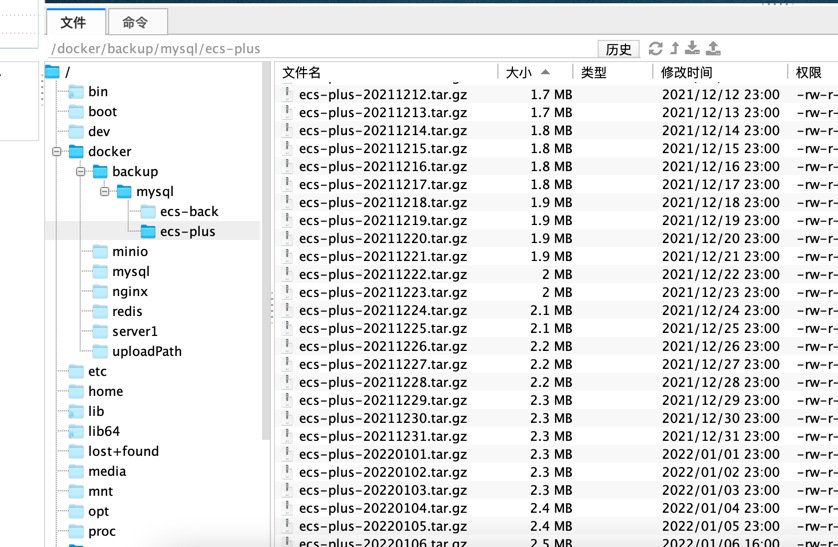

## 1。编写 定时备份sh文件 <a href="https://vkceyugu.cdn.bspapp.com/VKCEYUGU-e00f77be-b812-441e-b9b1-6303f61df661/a7ba5945-1c22-4d8c-8942-d0f52cc47ce5.sh" target="_blank">点击下载SH附件</a>
```angular2html
#!/bin/bash
# 要备份的数据库名，多个数据库用空格分开
databses=(ecs-plus ecs-back)

# 备份文件要保存的目录
basepath='/docker/backup/mysql/'

if [ ! -d "$basepath" ]; then

mkdir -p "$basepath"

fi

# 循环databases数组
for db in ${databses[*]}

do

# 每个数据库文件夹
if [ ! -d "$basepath/$db" ]; then

mkdir -p "$basepath/$db"

fi

# 备份数据库生成SQL文件
docker exec mysql mysqldump -uroot -ppassword $db > $basepath$db/$db-$(date +%Y%m%d).sql
# 备份数据库到从库 未知原因不好使 弃用 如需要请看另一篇主从同步
# docker exec -it mysql mysqldump --host=127.0.0.1 -uroot -ppassword -C --databases ecs-plus |mysql --host=XXX.XXX.XXX.XXX -uroot -ppassword ecs-cong

# 将生成的sql文件压缩
/bin/nice -n 19 tar zPcf $basepath$db/$db-$(date +%Y%m%d).tar.gz $basepath$db/$db-$(date +%Y%m%d).sql

# 删除7天之前的备份数据
find $basepath/* -mtime +20 -name ".tar.gz" -exec rm -rf {} \;

done

# 删除生成的SQL文件
rm -rf $basepath/*/*.sql

```

## 2。编辑定时任务
### 2.1 编辑
```angular2html
crontab -e 
```
### 2.2 输入i编辑 输入以下代码
```
0 */1 * * * /docker/docker-backup-mysql.sh >> /docker/backup-mysql.log
```
### 2.3 按esc 然后:wq 回车保存 退出
## 3。查看定时任务
```
crontab -l
```
### 4。备份情况


