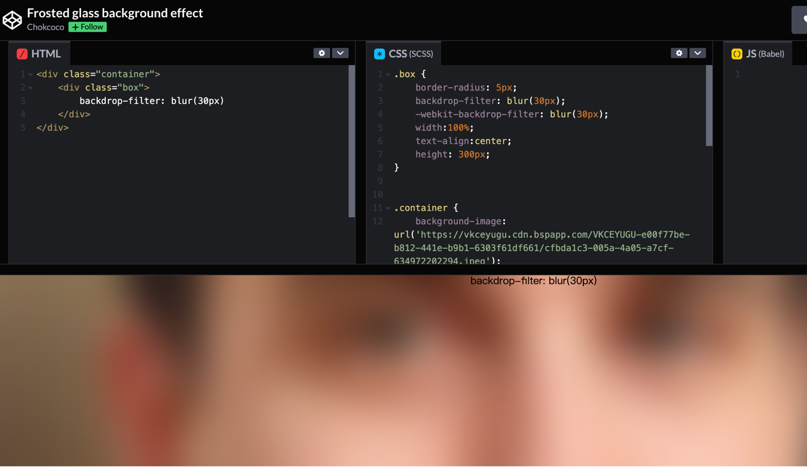

## 话不多说直接教程
在 CSS 中，也就是借助 background + backdrop-filter: blur() 即可实现。
##效果

## 使用 backdrop-filter 实现高斯模糊蒙版 这里简单列下代码
```angular2html
<div class="container">
    <div class="box">
        backdrop-filter: blur(10px)
    </div>
</div>
```
```angular2html
.box {
    border-radius: 5px;
    backdrop-filter: blur(10px);
    -webkit-backdrop-filter: blur(10px);
    width:100%;
    text-align:center;
    height: 300px;
}


.container {
    background-image: url('https://vkceyugu.cdn.bspapp.com/VKCEYUGU-e00f77be-b812-441e-b9b1-6303f61df661/cfbda1c3-005a-4a05-a7cf-634972202294.jpeg');
    background-position: center center;
    background-repeat: no-repeat;
    background-size: cover;
    align-items: center;
    display: flex;
    justify-content: center;
    height: 300px;
    width: 100%;
}
```


