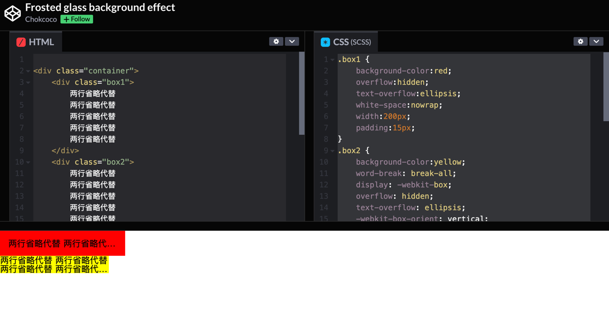

## 话不多说直接教程
在 CSS 中，也就是借助 overflow:hidden;
text-overflow:ellipsis;
white-space:nowrap; 配合即可实现。
## 效果

## 这里简单列下代码
```html
<div class="container">
    <div class="box1">
        单行省略代替
        单行省略代替
        单行省略代替
        单行省略代替
        单行省略代替
    </div>
    <div class="box2">
        两行省略代替
        两行省略代替
        两行省略代替
        两行省略代替
        两行省略代替
    </div>
</div>
```

```CSS
.box1 {
    background-color:red;
    overflow:hidden;
    text-overflow:ellipsis;
    white-space:nowrap;
    width:200px;
    padding:15px;
}
.box2 {
    background-color:yellow;
    word-break: break-all;
    display: -webkit-box;
    overflow: hidden;
    text-overflow: ellipsis;
    -webkit-box-orient: vertical;
    -webkit-line-clamp: 2;//设置几行
    width:200px;
}
.container {
    height: 300px;
    width: 100%;
}
```


